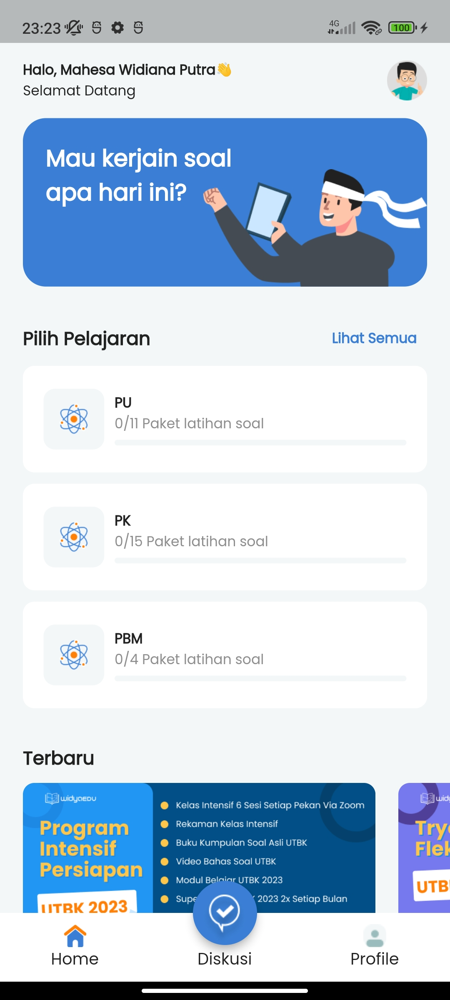
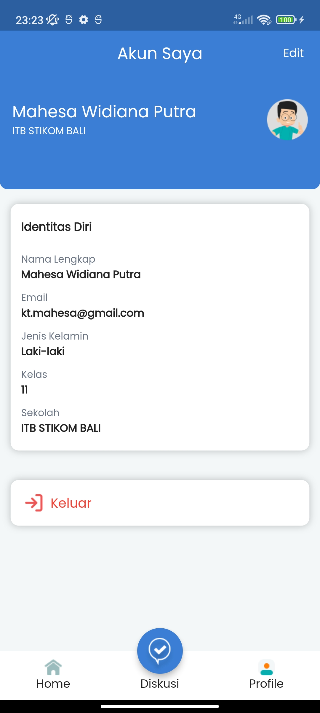
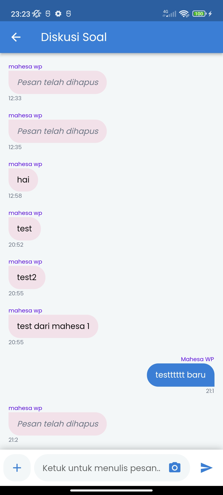
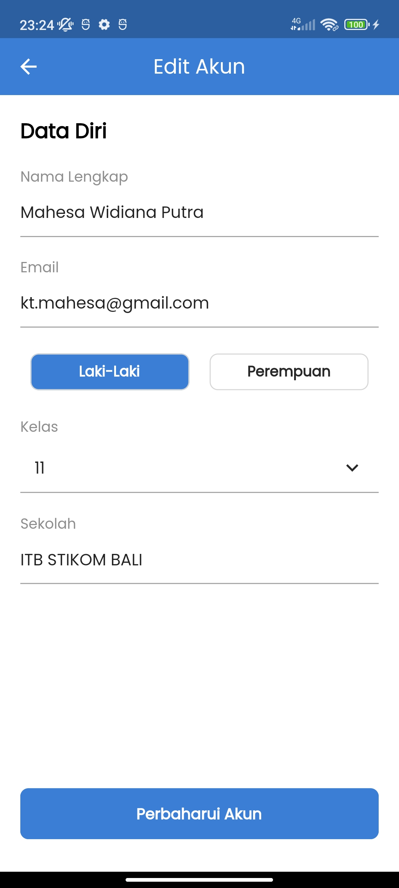
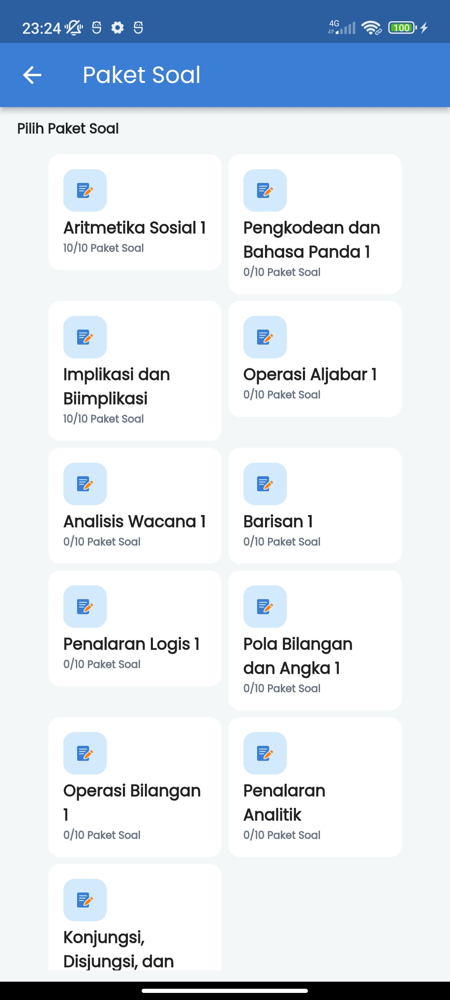
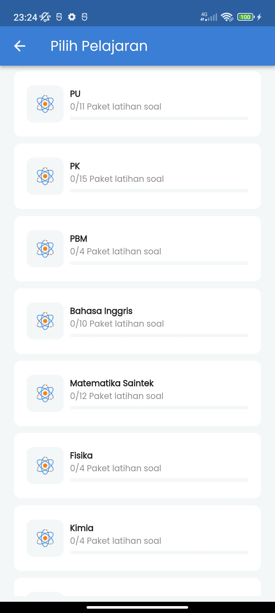
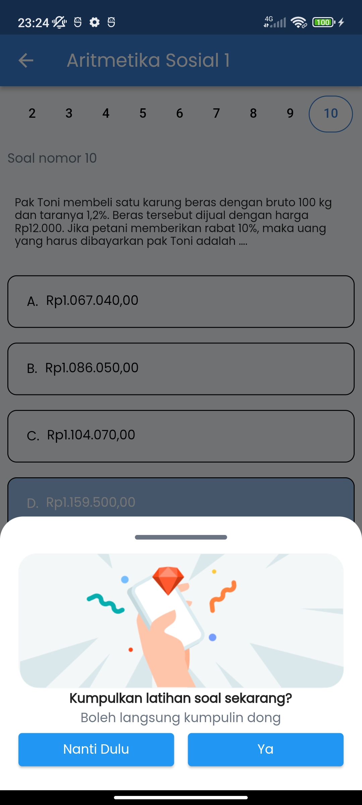
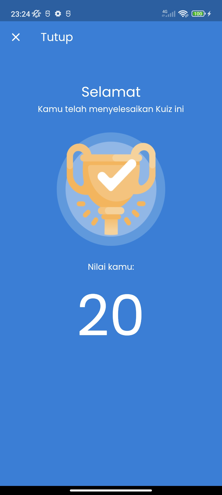

# latihan_soal_app

A final assignment flutter project by me for my mini bootcamp class Edspert id.

I'm so glad if you take your precious time to see this little project :)

## Screen Shot

    
    
    
    
    
    
    
    
    

## Third Libraries
- Firebase (Authentication, FCM, Storage)
- Provider
- shared_preferences